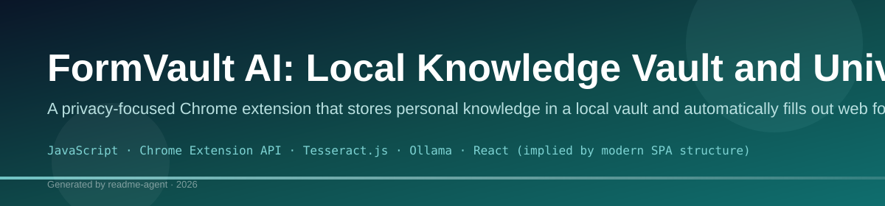
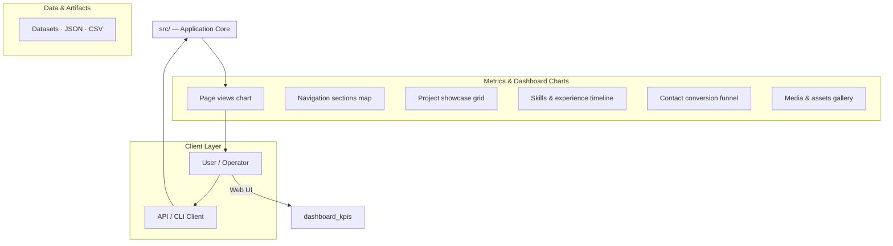
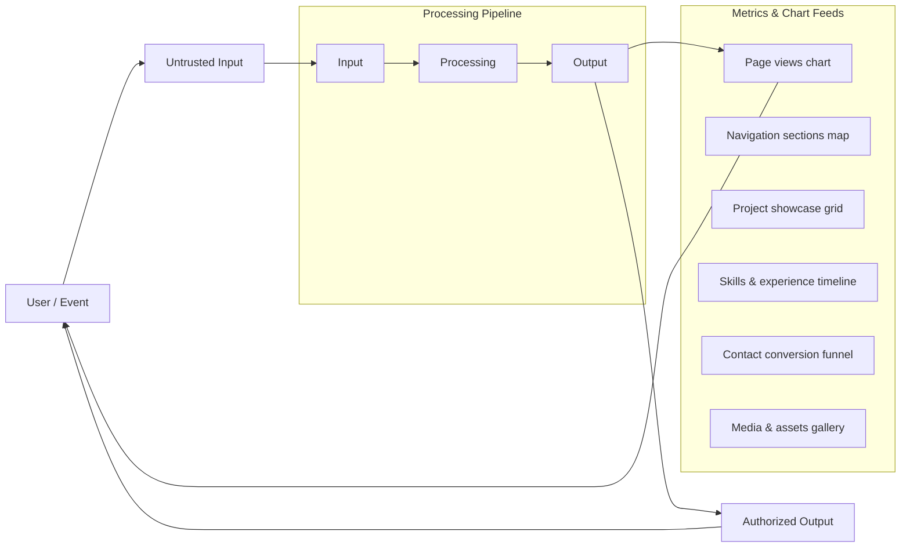
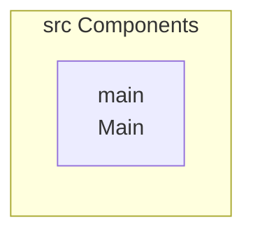
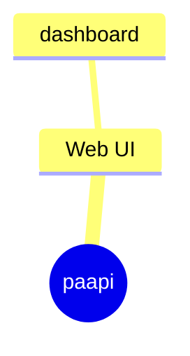

# FormVault AI

A privacy-first Chrome extension that acts as a personal knowledge vault and intelligent form-filling assistant. All data stays on your device — encrypted, local, and never shared with any server.

## Features

- **Encrypted Personal Vault** — Store reusable personal information (name, phone, email, addresses, IDs, education, skills, etc.) with AES-256 encryption
- **Multiple Profiles** — Switch between Personal, Job Application, Scholarship, and custom profiles instantly
- **Smart Document Repository** — Upload PDFs, DOCX, TXT, and images; auto-extract text and personal data
- **Paste & Extract** — Paste resumes, research papers, NDAs, invoices, or any long text; extract structured fields with Ollama or local parsing
- **Document Scanning** — Ollama vision for IDs (Aadhaar, PAN) when configured; Tesseract OCR fallback for images
- **Universal Autofill Engine** — Detect and fill form fields on any website with synonym matching and learned mappings
- **One-Click Form Fill** — Floating assistant button with fill report (filled / review / unknown)
- **AI Long Answer Generator** — Generate contextual responses for application questions (local-first, optional API)
- **Saved Answers Library** — Reusable responses for common form questions
- **Smart Text Expansion** — Type `@phone`, `@email`, `@github` to insert stored values
- **Form Learning System** — Learns field mappings from manual entries per domain
- **Local Search Engine** — Search across vault fields, documents, and saved answers
- **Encrypted Backup & Restore** — Export/import your vault as encrypted JSON

## Privacy Guarantees

- No cloud database
- No user accounts
- No analytics or telemetry
- No third-party data sharing
- All processing happens locally on your device

## Tech Stack

| Layer | Technology |
|-------|-----------|
| Extension | React, TypeScript, Tailwind CSS, Manifest V3 |
| Storage | IndexedDB, Chrome Storage API |
| Encryption | Web Crypto API (AES-256-GCM, PBKDF2) |
| PDF Parsing | PDF.js |
| DOCX Parsing | Mammoth.js |
| OCR | Tesseract.js (offline fallback) |
| AI | Local templates, **Ollama** (text + vision models), optional cloud API keys |

## Install as a Chrome Extension (Developer Mode)

FormVault AI is loaded as an **unpacked extension** from the built `formvault-extension` folder.

**Easiest way (Windows):** double-click `install-chrome-extension.bat`

Or run:

```bash
npm install
npm run chrome
```

This builds the extension and opens the correct folder in File Explorer.

After `npm run build`, the extension is also copied to your Desktop:

`C:\Users\<you>\Desktop\FormVaultAI-Load-In-Chrome`

Use **either** that Desktop folder **or** `formvault-extension` inside this repo — not the `paapi` root.

### Manual install

1. Run `npm run build`
2. Open `chrome://extensions`
3. Enable **Developer mode**
4. Click **Load unpacked**
5. Select the build folder (examples):
   - `...\Desktop\FormVaultAI-Load-In-Chrome`
   - `...\paapi\formvault-extension`

### After code changes

1. Run `npm run build`
2. Click **Reload** on the FormVault AI card in `chrome://extensions`

### Troubleshooting

| Problem | Fix |
|---------|-----|
| "Manifest file is missing or unreadable" | You selected the **`paapi`** repo root by mistake — select **`formvault-extension`** or the Desktop copy |
| Extension doesn't update | Click **Reload** on `chrome://extensions` after rebuilding |
| Popup is blank or errors | Rebuild with `npm run build`, reload extension, right-click icon → **Inspect popup** for details |
| Ollama error (403) | Chrome extensions need Ollama to allow extension origins. In PowerShell: `$env:OLLAMA_ORIGINS="chrome-extension://*"; ollama serve` |
| "Message port closed" in console | Reload the extension; ensure the service worker is running (click **Service worker** on the extension card) |
| Paste & Extract only finds a few fields | Ollama may be offline — local parsing still works for labeled text (invoices, NDAs, resumes). Configure a **text** model in Settings (not vision-only) |

### Using Ollama (local AI models)

FormVault AI uses **locally downloaded Ollama models** for long answers, paste extraction, and document vision scans. No cloud API is required.

1. Install [Ollama](https://ollama.com) and start it
2. Download models:
   - Text: `ollama pull llama3.2`
   - Vision (IDs, images): `ollama pull llama3.2-vision`
3. **Allow Chrome extensions** (required on Windows):

   ```powershell
   $env:OLLAMA_ORIGINS="chrome-extension://*"
   ollama serve
   ```

4. Rebuild and reload the extension
5. Open FormVault AI → **Settings** → **AI Provider** → **Ollama**
6. Refresh models and select a text model; set a vision model under **Document scanning**

## Build for Production

```bash
npm run build
```

The loadable Chrome extension is in **`formvault-extension`** (and copied to Desktop).

## Project Structure

```
src/
├── background/          # Service worker (session, messaging, Ollama proxy)
├── content/             # Content script + floating assistant
├── popup/               # Extension popup dashboard
├── offscreen/           # OCR worker (Tesseract)
├── lib/
│   ├── ai/              # Answer generation + Ollama client
│   ├── autofill/        # Field matching + form scanner
│   ├── backup/          # Encrypted export/import
│   ├── crypto/          # AES encryption + session management
│   ├── documents/       # PDF/DOCX parsing, OCR, paste extract
│   ├── learning/        # Form field learning system
│   ├── messaging/       # Safe extension message helpers
│   ├── search/          # Local search engine
│   ├── storage/         # IndexedDB + Chrome storage
│   └── vault/           # Profile + vault management
├── styles/              # Global Tailwind styles
└── types/               # TypeScript type definitions
```

## Usage

1. **First launch** — Set a master password to create your encrypted vault
2. **Fill your vault** — Add info in the Vault tab, upload documents in Docs, or use **Paste & Extract**
3. **Create profiles** — Set up different profiles for job apps, scholarships, etc.
4. **Fill forms** — Visit any website with a form, click the floating button or use the popup **Fill** tab
5. **Text expansion** — Type `@phone` or `@email` in any input field
6. **Job portal scan** — On LinkedIn, Naukri, Indeed, etc., click the floating **scan** button or **Job Portal** label to scan all fields, upload a PNG/PDF or paste text, then autofill
7. **Backup** — Export an encrypted backup from Settings

## Roadmap

- [x] Tesseract.js OCR for image documents
- [x] Ollama vision + text extraction for documents and pasted text
- [ ] ONNX Runtime Web / Transformers.js for in-browser LLM inference
- [ ] WebAuthn biometric unlock
- [ ] Sidebar mode on web pages
- [ ] Keyboard shortcuts
- [ ] High contrast accessibility mode

## License

Private — All rights reserved.

## Setup Guide

### Frontend Setup

```bash

npm install
npm run dev     # development
npm run build && npm start   # production
```

Open `http://127.0.0.1:5173` (or the port shown in the terminal).

### Running the Application

1. **Start web app** — `npm run dev` in `./`

```bash
cd .
npm install
npm run dev
```

## System Architecture

High-level system design, data flows, API map, and workflow pipelines derived from the repository structure.

### System Architecture



### Data Flow & Charts Pipeline



### Component & API Map



### Application Page Map


