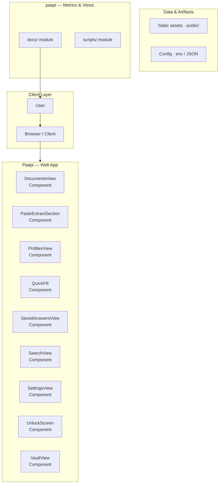
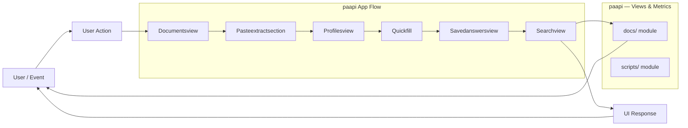
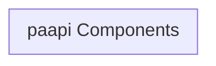
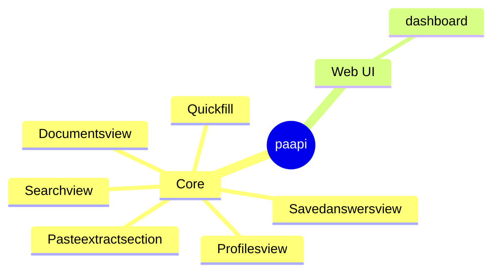

# FormVault AI: Privacy-First Knowledge Vault and Autofill Assistant

A local, privacy-focused Chrome extension designed to act as a personal knowledge vault, intelligently parsing documents and providing universal autofill capabilities without sending data to the cloud.

## Overview

FormVault AI is a sophisticated, client-side Chrome extension built with React and TypeScript. Its primary function is to serve as a secure, encrypted personal knowledge vault where users can store, index, and retrieve personal information. The system emphasizes privacy by ensuring that all data processing, including document parsing and AI generation, occurs entirely locally on the user's machine. It provides advanced features such as universal autofill, document ingestion from various formats (PDF, DOCX, Images), and AI-powered querying via a local Ollama instance.

## Problem

Traditional digital assistants and knowledge management tools often require cloud connectivity and upload sensitive personal data (passwords, documents, personal facts) to remote servers, creating significant privacy risks. There is a need for a robust, intelligent, and highly secure personal vault solution that operates entirely offline and respects user data sovereignty.

## Solution

The solution is a local-first Chrome extension that implements a multi-layered security model. It uses the Web Crypto API for end-to-end encryption of stored data (the Vault). It ingests data from diverse sources (files, web forms) and indexes it locally using IndexedDB. It leverages local machine resources (Ollama) for AI processing, ensuring that sensitive data never leaves the user's device.

## Key Features

- Encrypted Personal Vault: Secure storage for sensitive data using AES-256 encryption.
- Universal Autofill: Automatically populates form fields across various websites using stored knowledge.
- Multi-Profile Support: Allows users to segment and manage different sets of personal data (e.g., 'Work Profile', 'Personal Profile').
- Document Ingestion: Supports parsing and indexing of various file types, including PDF, DOCX, and images.
- AI Knowledge Retrieval: Integrates with a local Ollama instance to allow natural language querying and generation based on the stored vault content.
- Local Search and Indexing: Provides fast, local search capabilities across all stored documents and entries.
- Privacy-First Design: Explicitly avoids cloud databases, analytics, or external data transmission.

## Technology Stack

- React
- TypeScript
- Tailwind CSS
- IndexedDB
- Web Crypto API
- PDF.js
- Mammoth.js
- Tesseract.js
- Ollama

# FormVault AI: The Privacy-First Local AI Assistant

FormVault AI is a revolutionary, privacy-centric AI assistant designed to help users manage, extract, and generate content from complex forms and documents entirely offline and locally. By running all processing—including large language model (LLM) inference—on the user's device, FormVault eliminates the risk of sending sensitive personal data to third-party cloud servers.

It acts as a secure, local vault and intelligent processing layer, making it ideal for professionals, researchers, and anyone handling highly sensitive information.

---

## 🛡️ Key Value Proposition: Privacy by Design

Unlike cloud-based AI tools, FormVault AI ensures that your data never leaves your machine. This commitment to local processing is the core differentiator, providing unparalleled security and compliance for sensitive data handling.

*   **100% Local Processing:** All AI inference and data storage occur client-side.
*   **Offline Capability:** Full functionality is available without an internet connection.
*   **Secure Vault:** Encrypted storage for all personal profiles and extracted data.

## ✨ Core Features

FormVault AI provides a comprehensive suite of tools, moving beyond simple form filling to intelligent document understanding and content generation.

### 🧠 Intelligent Document Processing

*   **Form Extraction:** Automatically identifies and extracts key-value pairs from various document formats (PDF, images, etc.).
*   **Multi-Format Ingestion:** Supports PDF (using PDF.js), image files, and structured data inputs.
*   **OCR Integration:** Utilizes Tesseract.js for robust Optical Character Recognition (OCR) on scanned documents and images.
*   **Structured Data Output:** Converts unstructured data into usable, structured formats for easy integration.

### 💼 Profile and Data Management

*   **Secure Vault:** Centralized, encrypted storage for multiple user profiles and personal data sets.
*   **Profile Management:** Allows users to maintain distinct, compartmentalized data sets for different professional roles or life aspects.
*   **Data Persistence:** Uses IndexedDB for reliable, local storage of all extracted and generated data.

### ✍️ AI Generation and Assistance

*   **Contextual Form Filling:** Uses extracted data and stored profiles to intelligently pre-fill complex forms, minimizing manual entry.
*   **Content Generation:** Generates drafts, summaries, and structured text based on user prompts and ingested documents.
*   **Job/Opportunity Scanning:** Analyzes job descriptions or academic requirements against stored profiles to identify matches and gaps.

## ⚙️ Technical Architecture and Stack

FormVault AI employs a sophisticated, client-side architecture designed for maximum performance and security. The system is divided into three primary components:

### 1. Technology Stack

*   **Frontend:** React and TypeScript for robust, scalable UI development.
*   **Styling:** Tailwind CSS for utility-first, responsive design.
*   **Local Storage:** IndexedDB for persistent, client-side data management.
*   **AI Engine:** Ollama integration for running local LLMs (Large Language Models).
*   **Document Parsing:** PDF.js and Mammoth.js for handling PDF and structured text.
*   **OCR:** Tesseract.js for image and scanned document text extraction.

### 2. System Flow (The Local Loop)

The entire process is contained within the browser environment, ensuring data isolation:

1.  **User Input:** The user provides a document (PDF/Image) or a prompt.
2.  **Client Service:** The React frontend captures the input and passes it to the Core Service.
3.  **Preprocessing:** The Core Service handles format conversion (PDF.js, Tesseract.js) and extracts raw text/data.
4.  **Local Inference:** The Core Service communicates with the locally running LLM via Ollama. The prompt and context are passed *only* to the local model.
5.  **Output:** The LLM generates the response, which is then securely stored in the IndexedDB Vault and displayed to the user.

## 🚀 Getting Started

### 💻 For Developers (Local Setup)

This project is a full-stack client application. To run the development environment:

1.  **Prerequisites:** Ensure Node.js and npm are installed.
2.  **Installation:** Clone the repository and install dependencies.
    ```bash
    npm install
    ```
3.  **Running the App:** Start the development server.
    ```bash
    npm run dev
    ```
4.  **LLM Setup:** Ensure Ollama is running and the required models are pulled locally (e.g., `ollama pull llama2`).

### 👤 For End-Users (Usage)

1.  **Installation:** Install the FormVault AI Chrome Extension from the official store.
2.  **Setup:** Open the extension and follow the guided setup to create your first secure profile.
3.  **Usage:**
    *   Click the extension icon when viewing a form or document.
    *   Select the relevant profile from the vault.
    *   The AI will process the data locally and provide suggestions or fill the form fields automatically.

## 📚 Documentation and Resources

*   **Architecture Diagram:** (Conceptual diagram detailing the flow from UI $
ightarrow$ Core Service $
ightarrow$ Ollama/LLM $
ightarrow$ IndexedDB Vault).
*   **API Reference:** Details on the local service endpoints and data schema for the Vault.
*   **Contribution Guidelines:** Guidelines for extending the feature set and integrating new parsers.

## Setup Guide

### Frontend Setup

```bash

npm install
npm run dev     # development
npm run build && npm start   # production
```

Open `http://127.0.0.1:5173` (or the port shown in the terminal).

### Running the Application

1. **Start web app** — `npm run dev` in `./`

```bash
cd .
npm install
npm run dev
```

## System Architecture

High-level system design, data flows, API map, and workflow pipelines derived from the repository structure.

### System Architecture



### Data Flow & Charts Pipeline



### Component & API Map



### Application Page Map


